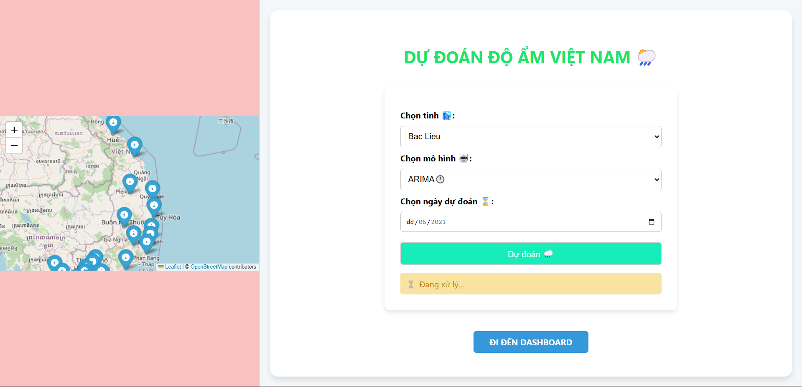
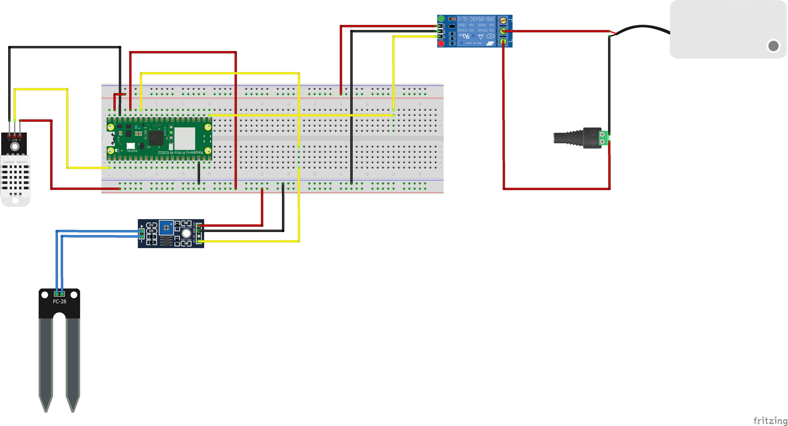

# Portfolio for Samsung Innovation Campus 2025 – Nguyễn Minh Hiếu

## About Me
I am Nguyen Minh Hieu, a technology enthusiast with a passion for data science and machine learning. I am currently interning at ATI CMC Institute, where my work focuses on AI deployment on edge devices. I am eager to join Samsung Innovation Campus 2025 to further develop my skills in AI and IoT, and to contribute to innovative projects in these fields.

## Certificates
- **Exploratory Data Analysis for Machine Learning** – IBM & Coursera, Dec 2024  
- **Supervised Machine Learning: Regression** – IBM & Coursera, Dec 2024  

## First Product (Image Processing, Hand Gesture Recognition, Mobile Robot Control)
This was my first product as a freshman, where I combined IoT and AI to create a system for hand gesture recognition and mobile robot control. Although the project did not succeed due to hardware limitations and my limited experience at the time, it taught me valuable lessons about system integration and the importance of testing. These insights have helped me improve the quality of my subsequent projects.  
[Watch the video here](https://github.com/MinhHieu13-cmc/SIC-2025-Portfolio/VID_20240511_110352_851.mp4)

## Projects
1. **Humidity Forecast in Vietnamese Provinces**  
     
   - Data includes 39 provinces of Vietnam from 2009-2021.  
   - Used machine learning to create 3 humidity prediction models (ARIMA, Random Forests, Linear Regression).  
   - Used Folium to create a map of Vietnam marking 39 provinces and cities.  
   - Connected to tawk.to's API to create a chatbot for analyzing humidity data of provinces.  
   - Created visual bar and wave charts of humidity values for each province.  
   - Used Django to develop a web interface for all functions.  
   - **Result**: Achieved an average prediction accuracy of 85% across the models.  
   - [View Project](https://github.com/MinhHieu13-cmc/Humidity-forecast-in-Vietnamese-provinces)  

2. **Automatic Irrigation IoT System**  
     
   - Used sensors (DHT22 and soil moisture) to collect real-time data.  
   - Trained Random Forests models with real data using machine learning.  
   - Designed an irrigation system using a Raspberry Pi Pico W microprocessor.  
   - Conducted predictions with real data to control a relay activation model for turning the pump on and off.  
   - Used Django to create a web interface for all functions.  
   - **Result**: Successfully automated irrigation with 90% accuracy in water usage optimization.  
   - [View Project](https://github.com/MinhHieu13-cmc/Hethongtuoitieutudong)  

## Contact
- Email: hieu89062@gmail.com  
- GitHub: [github.com/MinhHieu13-cmc](https://github.com/MinhHieu13-cmc)
